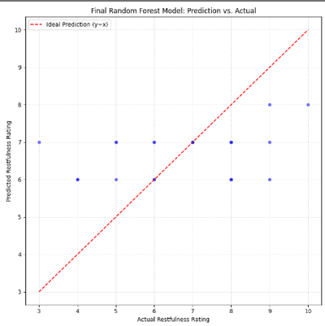
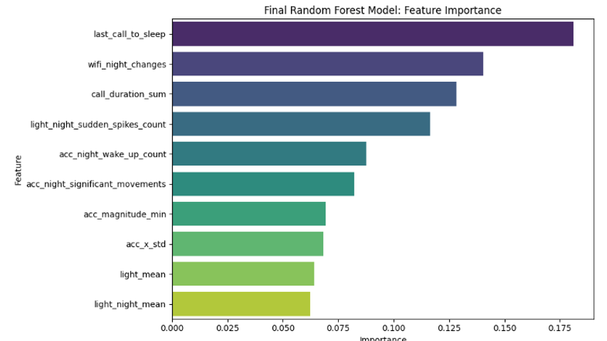
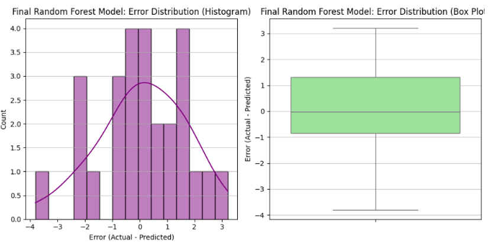

# 💤 Continuous Blending for Sleep Quality Detection

## 📘 Overview
**Continuous Blending for Sleep Quality Detection** is a data-driven machine learning project designed to predict **sleep restfulness** based on multi-sensor smartphone data and self-reported sleep questionnaires.
The project integrates advanced data processing, feature engineering, and feature selection pipelines to model and understand behavioral indicators of sleep quality.

---

## 🧩 Project Structure
├── main_5.py # Main analysis and modeling script, containing the full E2E pipeline.
├── data/ # Raw sensor and questionnaire data
├── sensor_data/ # Intermediate and cleaned sensor CSVs
├── DATA/ # Questionnaire responses
├── outputs/ # Plots and evaluation results
├── assets/ # Visualizations and images for README
└── README.md # Project documentation

---

## ⚙️ Methodology & Pipeline

### **1. Data Loading & Cleaning**
Data from 9 participants across 3 sessions were collected and preprocessed:
- Missing values handled with tailored imputation strategies:
  - Forward/backward fill, mean-based filling, and advanced methods (`KNNImputer`, `SimpleImputer`).
- Outlier correction and normalization per participant using `StandardScaler`.

### **2. Feature Engineering**
- Extracted **54 daily features** from accelerometer, call, light, screen, location, and Wi-Fi sensors.
- Derived **cross-sensor features** to capture multi-modal behavioral patterns (e.g., *pre-sleep activity*, *night disturbances*).

### **3. Feature Vetting**
A rigorous vetting pipeline reduced the feature set from 54 to 15 using:
- Outlier capping via IQR
- Mutual Information (MI) feature relevance
- Redundancy removal via Spearman correlation and MI
- Final selection using **ReliefF**

### **4. Feature Selection (Wrapper Method)**
The final **10 optimal features** were selected using **Exhaustive Feature Selection (EFS)** with a `RandomForestRegressor`, optimizing for
`neg_mean_squared_error` over 5-fold cross-validation.

### **5. Model Development**
Model: `RandomForestRegressor`
Hyperparameter tuning yielded:
- n_estimators=100
- min_samples_split=10
- min_samples_leaf=2
- max_features=0.6
- max_depth=30
- bootstrap=True

---

## 📊 Results Summary

| Model Type | MSE | RMSE | R² |
|-------------|-----|------|----|
| **Final Random Forest** | **2.5071** | **1.5834** | **0.1255** |
| Baseline (Average) | 2.9407 | 1.7148 | -0.0257 |
| Baseline (Sleep Hours) | 3.2645 | 1.8068 | -0.1387 |

✅ The Random Forest model outperformed both baselines, achieving a **positive R² (≈0.125)**, demonstrating meaningful explanatory power for restfulness scores.

---

## 📈 Visualizations

### **1. Prediction vs. Actual**
*Scatter plot comparing predicted vs. actual restfulness scores.*



### **2. Feature Importance**
*Bar chart showing the relative importance of the top 10 selected features.*



### **3. Error Distribution**
*Histogram and box plot of model prediction errors (Actual - Predicted).*



---

## 🧠 Model Robustness Analysis

### **Weekday vs. Weekend**
| Period | MSE | R² |
|---------|-----|----|
| Weekdays | 2.62 | 0.0687 |
| Weekends | 2.29 | 0.1906 |

> The model performed better on weekends, suggesting more consistent behavioral patterns during rest days.

### **Limitations**
- **Small sample size (108 samples)** limits statistical generalization.
- **Sensor-only features** — physiological and environmental data (heart rate, temperature, noise, etc.) are missing.
- **Limited participant diversity** (9 individuals) reduces population generalizability.

---

## 🚀 Future Improvements
- Expand dataset (more participants, longer time span)
- Integrate physiological data from wearables
- Explore **deep learning models (RNNs, LSTMs)** for temporal dependencies
- Develop personalized models with fine-tuning per participant

---

## 💻 Running the Project

### **Requirements**
Install dependencies:
```bash
pip install -r requirements.txt

Run the main pipeline:
python main_5.py

Expected workflow:

Load and clean sensor + questionnaire data
Compute features
Merge and normalize datasets
Train & evaluate Random Forest model
Generate plots and save results

🧑‍💻 Author
Ofir Hagag Biomedical & Data Science Researcher 📍 Tel Aviv University
